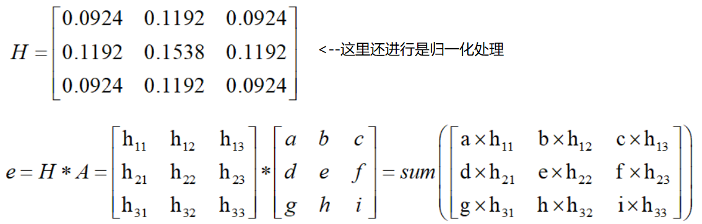
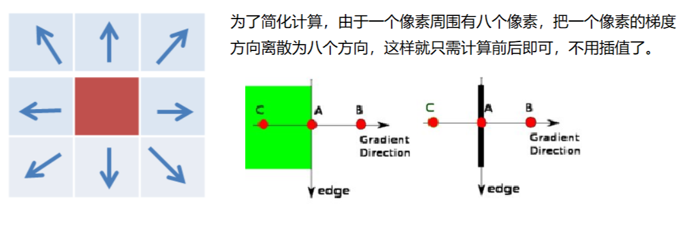

### HSV
- H - 色调（主波长）。 
- S - 饱和度（纯度/颜色的阴影）。 
- V值（强度）

### 图像阈值
```python
ret, dst = cv2.threshold(src, thresh, maxval, type)
```
- src： 输入图，只能输入单通道图像，通常来说为灰度图
- dst： 输出图
- thresh： 阈值
- maxval： 当像素值超过了阈值（或者小于阈值，根据type来决定），所赋予的值
- type：二值化操作的类型，包含以下5种类型： 
    - cv2.THRESH_BINARY           超过阈值部分取maxval（最大值），否则取0
    - cv2.THRESH_BINARY_INV    THRESH_BINARY的反转
    - cv2.THRESH_TRUNC            大于阈值部分设为阈值，否则不变
    - cv2.THRESH_TOZERO          大于阈值部分不改变，否则设为0
    - cv2.THRESH_TOZERO_INV  THRESH_TOZERO的反转
    
### 图像平滑
* 均值滤波


### Canny边缘检测
1. 使用高斯滤波器，以平滑图像，滤除噪声。
2. 计算图像中每个像素点的梯度强度和方向。
3. 应用非极大值（Non-Maximum Suppression）抑制，以消除边缘检测带来的杂散响应。
4. 应用双阈值（Double-Threshold）检测来确定真实的和潜在的边缘。
5. 通过抑制孤立的弱边缘最终完成边缘检测。

#### 高斯滤波器

#### 梯度和方向（用sobel算子）

####非极大值抑制


#### 双阈值检测
